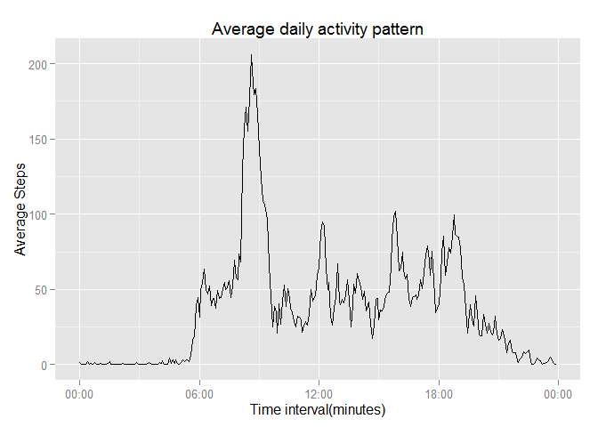
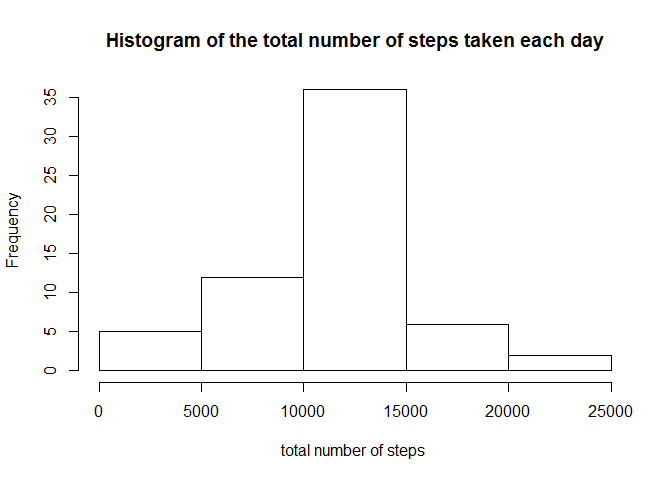
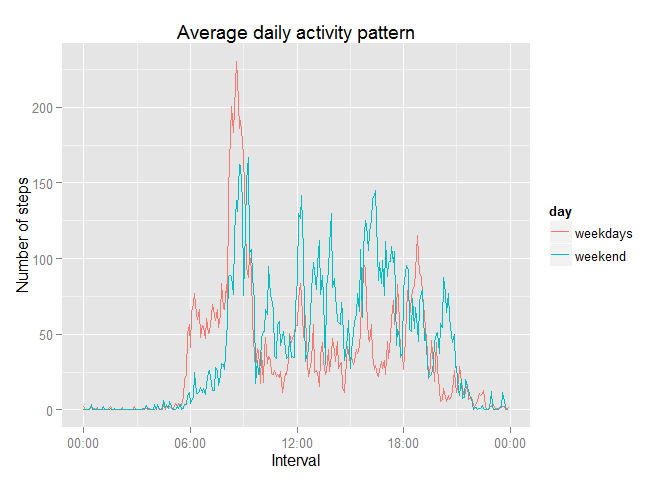

# Reproducible Research: Peer Assessment 1


## Loading and preprocessing the data


```r
library(ggplot2)
library(timeDate)
library(scales)

data.raw <- read.csv(unz('activity.zip','activity.csv'))
data <- na.omit(data.raw)
steps <- data$steps
date <- data$date
data$interval_revised <- sprintf("%04d", data$interval)
data$interval_time <- strptime(data$interval_revised, format = "%H%M")
```

## What is mean total number of steps taken per day?


```r
# histogram
total <- aggregate(steps ~ date, data= data,sum)
hist(total$steps,main ='Histogram of the total number of steps taken each day',xlab ='total number of steps ')
```

 

```r
# mean and median of total number of steps taken per day
mean(total$steps,na.rm = TRUE)
```

```
## [1] 10766.19
```

```r
median(total$steps,na.rm = TRUE)
```

```
## [1] 10765
```

## What is the average daily activity pattern?


```r
aves <- aggregate(data[,1],list(data$interval),mean)
aves <- data.frame(time = data$interval_time[1:288],aves)
g1 <- ggplot(aves,aes(time,aves$x))+geom_line() +xlab("Time interval(minutes)") + ylab("Average Steps") +list()
g1 + labs(title = "Average daily activity pattern")+scale_x_datetime(labels= date_format("%H:%M"))    
```

 


```r
# Get the most active 5-minute interval
data$interval_revised[which(aves$x == max(aves$x))]
```

```
## [1] "0835"
```
## Imputing missing values


```r
# calculate the total number of rows with NAs
length(which(is.na(data.raw)))
```

```
## [1] 2304
```


```r
# filling in all of the missing values
d <- cbind(x = data.raw,y = aves)
d$x.steps[is.na(d$x.steps)] <- d$y.x[is.na(d$x.steps)]  
data.new <- d[,1:3]
# new data set
total.new <- aggregate(data.new$x.steps ~ data.new$x.date, data= data.new,sum)
names(total.new) <- c("date","Newsteps")
```


```r
# new histogram
hist(x = total.new$Newsteps,main ='Histogram of the total number of steps taken each day',xlab ='total number of steps ')
```

 


```r
# mean and median value for new data set
mean(total.new$Newsteps,na.rm = TRUE)
```

```
## [1] 10766.19
```

```r
median(total.new$Newsteps,na.rm = TRUE)
```

```
## [1] 10766.19
```

### Conclusion: 
The shape of histogram, mean and median values of the pattern are almost the same as the previous one.In this way, there's little impact of imputing missing data on the estimates of the total daily number of steps

## Are there differences in activity patterns between weekdays and weekends?


```r
data.new$dayType <- "weekdays" 
data.new$dayType[isWeekend(data.new$x.date)] <- "weekend"
weekend <- data.new[isWeekend(data.new$x.date),]
weekday <- data.new[!isWeekend(data.new$x.date),]
aves.weekdays <- aggregate(weekday[,1],list(weekday$x.interval),mean)
aves.weekends <- aggregate(weekend[,1],list(weekend$x.interval),mean)
weekdays <- data.frame(time = data$interval_time[1:288], ave_steps = aves.weekdays, day = "weekdays")
weekend <- data.frame(time = data$interval_time[1:288], ave_steps = aves.weekends, day = "weekend")
pattern <- rbind(weekdays, weekend)
p <- ggplot(pattern, aes(time, ave_steps.x,group = day))
p + geom_line(aes(colour = day), size = .7) + labs(x = "Interval", y="Number of steps", title = "Average daily activity pattern")+scale_x_datetime(labels= date_format("%H:%M"))  
```

 
